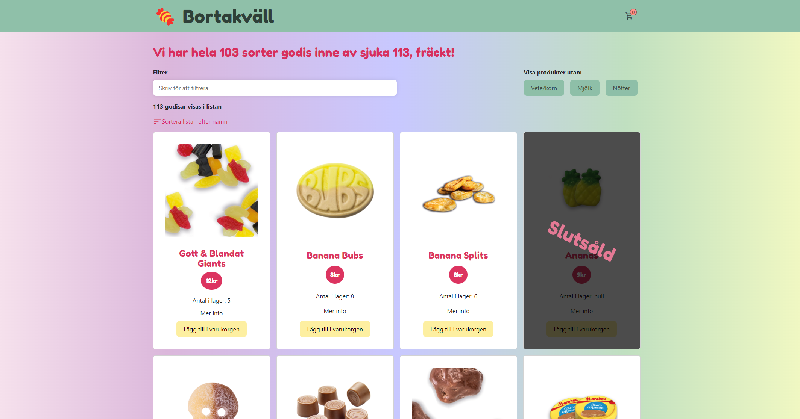

# 🍬 Candy product page

## 🔗 Links
🖥️ **Prod:** https://www.jotto.dev/project/candy-product-page

**Github:** https://github.com/devjoppe/mi-candy-product-page

### Screenshot

## About the project

This was a collaboration project together with [Harald Henriksson](https://github.com/HaraldHenriksson) and [Andreas Gustafsson](https://github.com/AndreasSBGustafsson) as our group assignment.

The purpose of the project was to:
* follow requirements specification
* Fetch data from API
* create a simple webshop with full functionality
* using Typescript
* working together with GIT